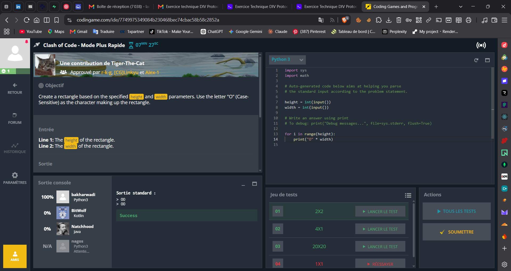
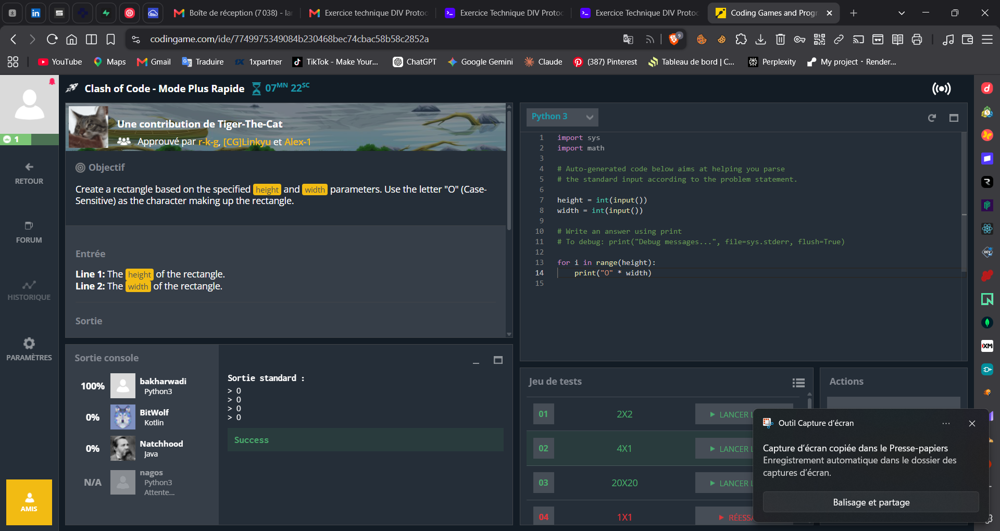
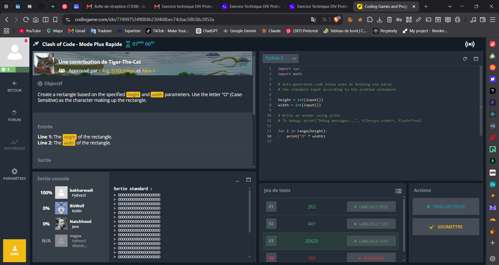
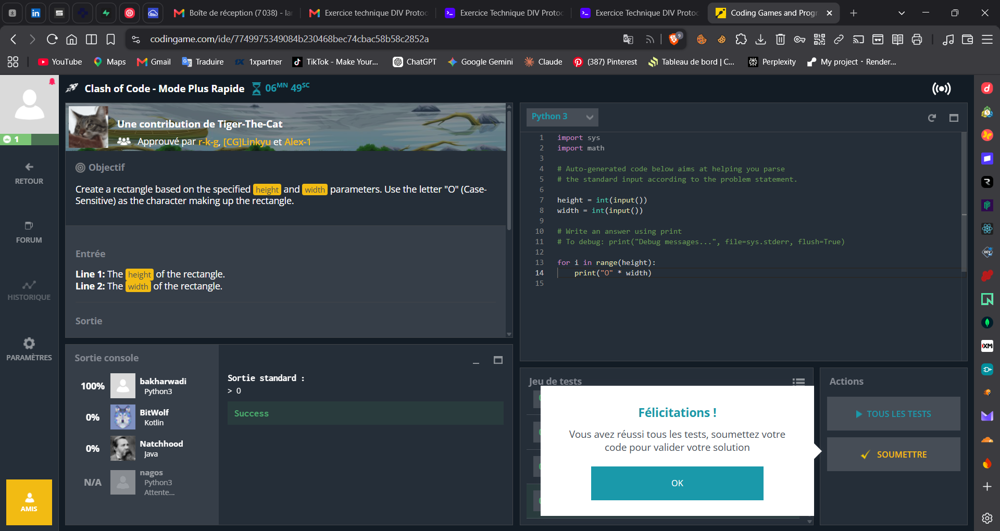
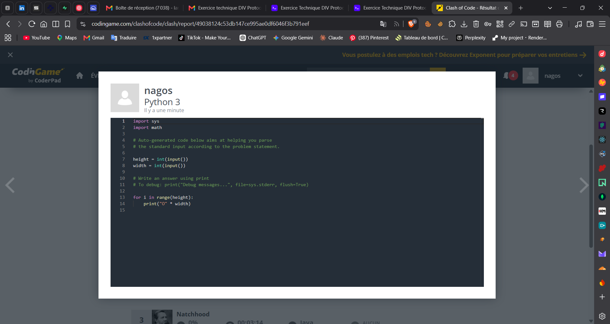
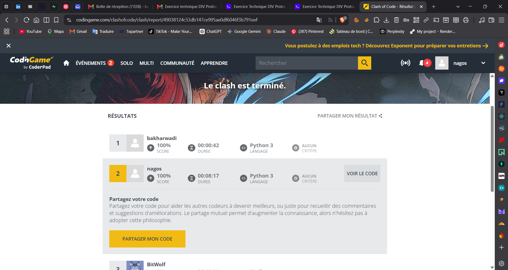
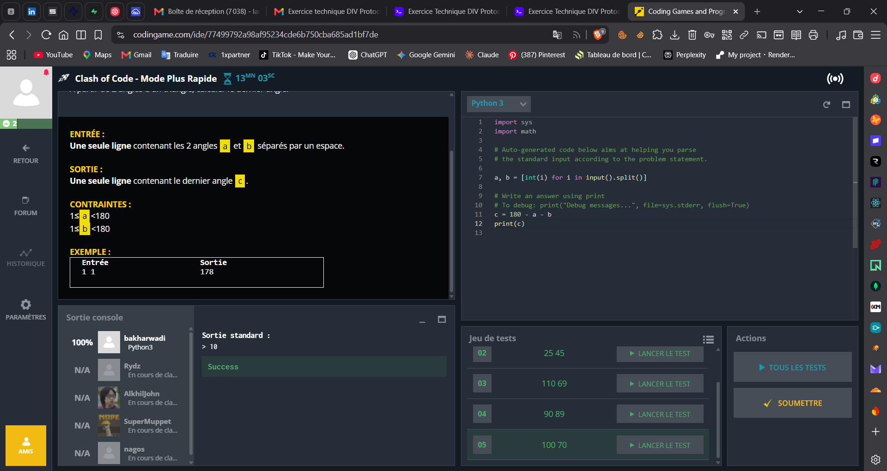
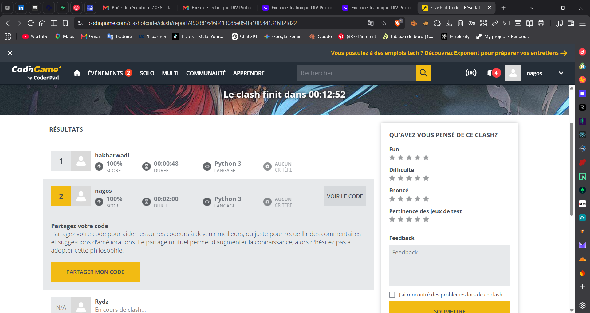
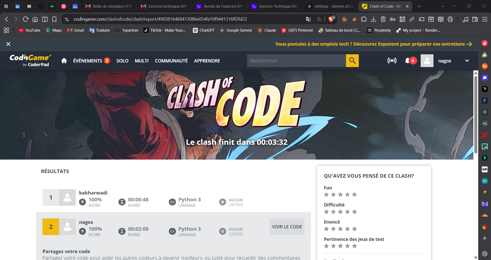

# Exercice 1 - sans IA

Deux epreuves d'algorithmie resolues **sans aucune assistance IA** : des clashs
CodinGame en temps limite, et le puzzle de grille de l'Advent of Code (jour 6,
"Guard Gallivant") en deux parties.

```text
clash-of-code/    10 captures d'ecran des deux clashs CodinGame
advent-of-code/
  part-1/         code.js + input.txt  - comptage des cases visitees
  part-2/         code.js + input.txt  - comptage des obstacles qui creent une boucle
```

## Setup

Seul l'Advent of Code contient du code a executer. Node.js 18+ suffit, aucune
dependance a installer : les deux scripts n'utilisent que `fs`.

```bash
cd exo1-no-ai/advent-of-code/part-1 && node code.js   # -> 4515
cd ../part-2                        && node code.js   # -> partie 1: 4515 / partie 2: 1309
```

`code.js` lit `input.txt` **par chemin relatif au repertoire courant**, il faut
donc bien se placer dans le dossier de la partie avant de lancer `node`.

Le dossier `clash-of-code/` ne contient que des preuves (images), rien a lancer :
les clashs se jouent dans l'IDE en ligne de CodinGame et le code y vit.

## Architecture

### Advent of Code - le probleme

Une grille contient des obstacles (`#`) et un garde (`^`) oriente vers le haut.
Le garde avance tout droit ; s'il a un obstacle devant lui il tourne a droite de
90 deg ; il s'arrete en sortant de la grille.

- **Partie 1** : combien de cases distinctes le garde visite-t-il ?
- **Partie 2** : combien de positions libres peut-on transformer en obstacle
  pour que le garde tourne indefiniment au lieu de sortir ?

### Partie 1 - simulation directe

`part-1/code.js` simule le parcours case par case. Les quatre directions sont
rangees dans l'ordre horaire (`haut, droite, bas, gauche`), ce qui fait du
quart de tour a droite un simple `d = (d + 1) % 4` : pas de `switch` sur une lettre
de direction, pas de table de correspondance a maintenir. Les cases visitees
sont accumulees dans un `Set` de cles `"r,c"`, donc le comptage final est un
`.size` sans deduplication a faire.

Le detail qui compte : quand la case devant est un obstacle, on **tourne sans
avancer**. Avancer et tourner dans le meme tour de boucle ferait rater les
angles ou deux obstacles se suivent (le garde doit pouvoir tourner deux fois de
suite sur place).

### Partie 2 - detection de boucle par etat (position + direction)

Une simulation ne peut pas detecter une boucle en surveillant les *positions* :
le garde repasse legitimement sur une case deja visitee en la traversant dans
une autre direction. L'invariant correct est le triplet **(ligne, colonne,
direction)** : si le garde se retrouve exactement dans un etat deja rencontre,
la suite du parcours est deterministe et donc identique - c'est une boucle.

`walf()` marque ces etats dans un `Uint8Array` de taille `rows * cols * 4`
indexe par `(r * cols + c) * 4 + d`, plutot que dans un `Set` de chaines : la
fonction est rappelee une fois par candidat, donc quelques milliers de fois, et
un tableau type plat evite de reconstruire et hacher une chaine a chaque pas.

**Reduction de l'espace de recherche** : les candidats testes ne sont pas les
`rows * cols` cases de la grille, mais uniquement les cases du **parcours
d'origine** (celles retournees par la partie 1), position de depart exclue. Un
obstacle pose ailleurs ne peut par definition jamais etre rencontre, donc ne
peut pas changer la trajectoire. Cela ramene ~16 000 simulations a ~4 500.

La grille est mutee puis restauree (`'#'` -> `'.'`) entre deux essais plutot que
copiee : une copie complete par candidat coute plus cher que la simulation
elle-meme.

Enfin, la partie 2 **contient** la partie 1 : le premier appel `walf(0)`
retourne a la fois `visited` (la reponse 1) et l'ensemble des candidats. Les
deux reponses sont donc affichees par le meme script, et `part-1/` est conserve
tel quel comme trace de la premiere soumission.

## Tests

Il n'y a **pas de suite de tests automatisee** sur cet exercice : les deux
epreuves sont validees par un oracle externe.

- **CodinGame** valide lui-meme : chaque clash fait tourner le jeu de tests
  officiel (`2X2`, `4X1`, `20X20`, `1X1`...) puis les tests caches a la
  soumission. Les captures montrent le passage de chaque test puis le score
  final de **100%** sur les deux clashs.
- **Advent of Code** valide la reponse soumise sur le site. Les deux scripts ont
  ete relances avant ce rendu : `4515` (partie 1) et `1309` (partie 2).
- **Recoupement interne** : la partie 2 recalcule la partie 1 par un chemin de
  code different (`Uint8Array` d'etats au lieu d'un `Set` de positions) et
  trouve la meme valeur, `4515`. Les deux implementations se controlent donc
  mutuellement sur l'entree reelle.

## Limites

- **Pas de tests unitaires ni de petit exemple de reference.** L'exemple
  10x10 fourni par l'enonce (reponses connues : 41 et 6) aurait fait un cas de
  test evident, et aurait permis de valider la logique sans dependre de
  l'entree complete. C'est ce que j'ajouterais en premier.
- **Entree en dur.** Le nom `input.txt` et le chemin relatif sont codes dans
  chaque script : pas de `process.argv`, donc impossible de rejouer sur une
  autre entree sans editer le fichier.
- **Partie 2 en force brute assumee.** ~4 500 simulations completes, quelques
  secondes d'execution. L'approche fine (rejouer seulement la portion de
  trajectoire affectee, en repartant de l'etat juste avant l'obstacle ajoute
  plutot que du depart) diviserait le cout, mais complique nettement le code
  pour un gain sans interet a cette taille d'entree.
- **Une faute de frappe conservee** : la fonction de la partie 2 s'appelle
  `walf` au lieu de `walk`. Le fichier est laisse tel qu'il a ete soumis, avec
  ses commentaires d'origine - le renommer aurait rendu le rendu moins fidele a
  ce qui a reellement ete ecrit pendant l'exercice.
- **Clash of Code : les captures ne sont pas un enregistrement continu.** Voir
  "Preuves" - c'est l'enregistrement video qui joue ce role.

## Preuves

### Enregistrement video

L'enregistrement de la session est dans le dossier Drive de l'exercice :

**<https://drive.google.com/file/d/1lRnNGKJTffv2LOOA8KzH45YxV-khSEh3/view>**
(dossier complet : <https://drive.google.com/drive/folders/16QDVNkcQ-ljvw6ZbIKb2OYGz07p1Wl4b>)

Il n'est pas commite dans le depot : 2,7 Go, hors de ce que Git doit porter.

### Captures des clashs

Deux clashs CodinGame en **Mode Plus Rapide**, joues en Python 3 sous le pseudo
`nagos`, tous les deux termines a **100%** et classes **2e**.

#### Clash A - "construire un rectangle de `O` de height x width"

Captures 1 a 5 : l'IDE en cours de clash, un test du jeu officiel valide a
chaque fois (`2X2`, `4X1`, `20X20`), jusqu'a l'ecran "Felicitations ! Vous avez
reussi tous les tests" qui debloque la soumission. La capture 3 est la meme
etape que la 2, la popup de l'outil de capture d'ecran en moins.







Captures 6 et 7 : le rapport de fin de clash. Le code soumis
(`for i in range(height): print("O" * width)`), puis le classement final -
1er `bakharwadi` 100%, **2e `nagos` 100% en 8:17**, 3e `BitWolf` 0%.




#### Clash B - "le 3e angle d'un triangle a partir des deux autres"

Capture 8 : l'enonce et la solution (`c = 180 - a - b`), test valide. Captures
9 et 10 : le rapport, a deux moments du compte a rebours - 1er `bakharwadi`
100%, **2e `nagos` 100% en 2:00**, les autres participants encore en clash.





Le decompte visible en haut des captures 1 a 5 (07:27 -> 06:49 de temps
restant) situe la chronologie du clash A : 38 secondes separent le premier test
lance de l'ecran "tous les tests reussis". Le temps de 8:17 affiche au
classement se compte, lui, depuis le debut du clash - il inclut la lecture de
l'enonce, l'ecriture du code et les allers-retours avant la soumission.
